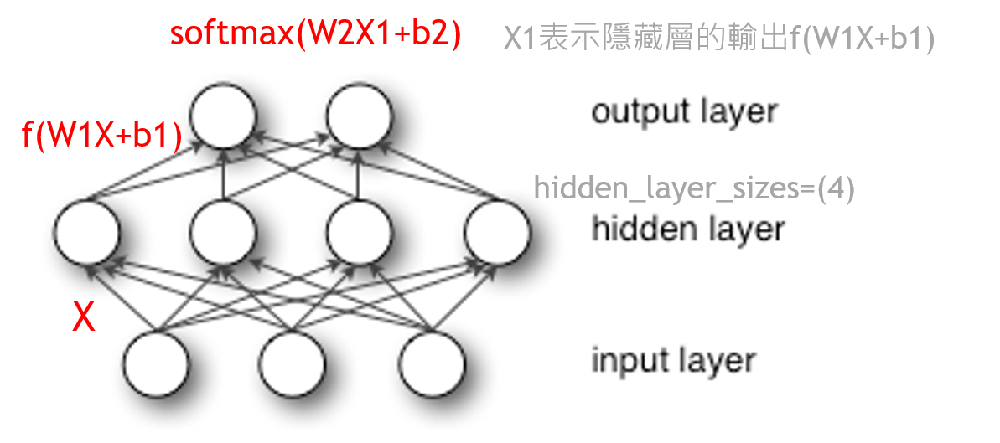
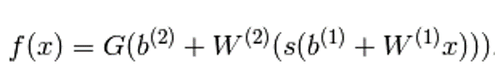
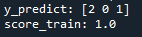

# Multilayer-Perceptron
使用python3.8練習Multilayer Perceptron
## Multilayer-Perceptron介紹
* 特性:

  也叫人工神經網路（ANN，Artificial Neural Network），屬於一種分類器，層與層之間是全連線的

* 概念:
  
  
  
  多層感知機最底層是輸入層，中間是隱藏層，最後是輸出層，W1是權重（也叫連線係數），b1是偏置，函式f 可以是常用的sigmoid函式或者tanh函式，所以其實隱藏層到輸出層可以看成是一個多類別的邏輯迴歸，亦即softmax迴歸

  這個三層的MLP用公式總結起來就是，函式G是softmax
  
  

## 程式碼: 

  * 輸入:
    > X = [[0., 0.,0.], [1., 1.,1.],[2., 2.,2.]]

    > y = [0, 1, 2]  
    
    代表0對照輸出種類0，1對照輸出種類1，2對照輸出種類2
    
  * MLP model:
    > clf = MLPClassifier(solver='lbfgs', alpha=1e-5,hidden_layer_sizes=(5,3), random_state=1)
    
    > clf.fit(X, y)
    
    * solver(優化方式):
    
          官方建議，在小型的資料集中使用L-BFGS
    * alpha(L2正規化參數)
    * hidden_layer_sizes(隱藏層的數量):
    
          幾個數字代表幾層，第n個數字代表第n層的神經元數量
    * random_state(隨機數種子)    
  * 預測值:
    > y_predict=clf.predict([[2., 2., 2.], [-1., -2.,0.],[1., 1.,0.]])
  * 欲呈現結果:
    > print('y_predict:',y_predict)
    
    > print('score_train:',clf.score(X,y))
    
    * y_predict:
    
          表示預測結果
    
    * score_train:      
    
          表示預測精確度
          
* 成果: 

  
